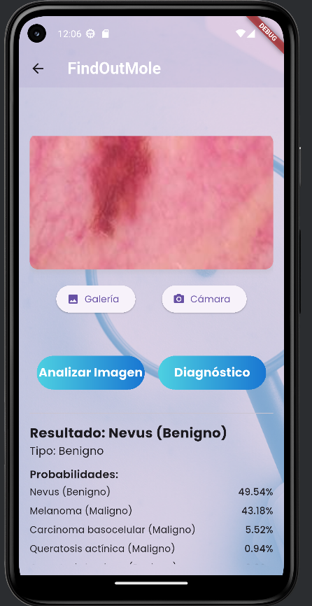
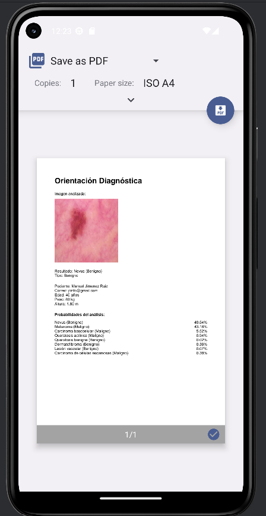
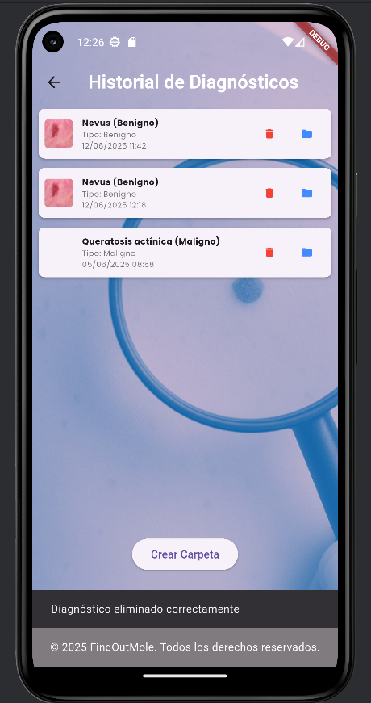
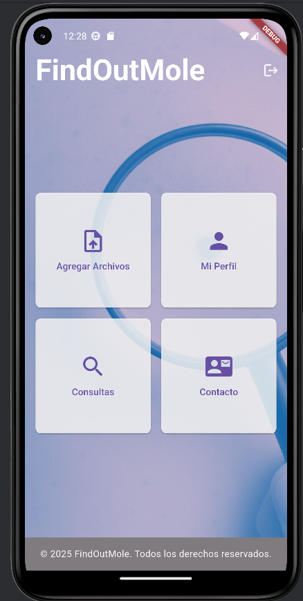
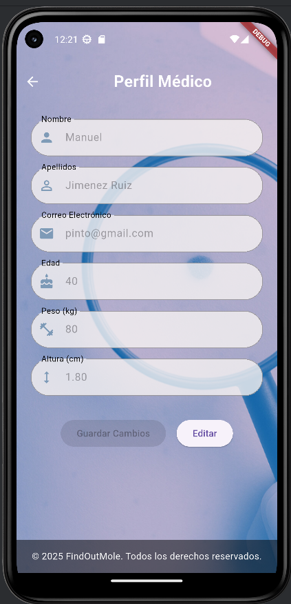

# FindOutMole hola

**FindOutMole** es una aplicación multiplataforma desarrollada en Flutter que permite analizar imágenes de lunares para ofrecer una predicción basada en inteligencia artificial. Su objetivo es ayudar en la detección temprana de posibles anomalías dermatológicas.

---

## Funcionalidades

- Subida de imágenes desde cámara o galería.
- Predicción automática mediante un modelo de IA entrenado con PyTorch.
- Resultados visuales con porcentaje de predicción.
- Historial de diagnósticos por usuario.
- Registro y autenticación con Firebase.
- Generación automática de informes en PDF desde la vista de resultados:
    *Incluye la imagen analizada, el resultado del diagnóstico, tipo, y datos del paciente.
    *El usuario puede pulsar el botón Guardar para descargar el informe como PDF directamente desde el navegador.
- Backend desarrollado en FastAPI y desplegado en Render.

---

## Tecnologías utilizadas

### Frontend (Flutter):
- Flutter (Web y Android)
- Firebase Auth
- Google Fonts

 --- 

### Backend:
- Python + FastAPI
- Firebase Admin SDK
- PyTorch
- Render (despliegue)

--- 

## Estructura del repositorio

├── lib/ # Código fuente Flutter
├── backend/ # Backend FastAPI
├── assets/ # Recursos visuales
├── firebase_options.dart # Configuración Firebase
├── pubspec.yaml # Dependencias Flutter
└── README.md

---

## Enlaces de despliegue

 **Frontend (Vercel)**  
    [https://findoutmole-copia.vercel.app](https://findoutmole-copia.vercel.app)

**Backend (Render)**  
    [https://findoutmole-backend.onrender.com](https://findoutmole-backend.onrender.com) *(API REST)*

### Aviso importante sobre el backend

> **ℹ️ Al abrir la app en Vercel por primera vez, es posible que el análisis de imágenes falle momentáneamente.**
> Esto se debe a que el backend desplegado en Render utiliza el plan gratuito, que entra en modo de hibernación cuando no hay actividad.
> Si aparece un error al analizar la imagen, espera entre **5 y 10 minutos** y vuelve a intentarlo. El servidor se reactiva automáticamente.
---

## Cómo ejecutar en local
 En api_service.dart, asegúrate de configurar enProduccion = false //para usar el backend local
 guardar
 flutter pub get
 Poner en la consola de la carpeta backend: uvicorn main:app --reload --host 0.0.0.0 --port 3000 //para funcionar lógica
 flutter run -d chrome
 
--- 

### Ejecutar en emulador movil

Abre Android Studio y carga el proyecto FindOutMole.
Inicia un dispositivo virtual desde Device Manager.
Asegúrate de que enProduccion = false en api_service.dart.
Arranca backend poniendo en la consola de esta carpeta: uvicorn main:app --reload --host 0.0.0.0 --port 3000

--- 

### Capturas app

### Vista del análisis de imagen


### Informe PDF generado automáticamente


### Historial de diagnósticos


### Pantalla de inicio


### Perfil médico


### Backend (FastAPI)

```bash
cd backend
pip install -r requirements.txt
uvicorn main:app --reload --host 0.0.0.0 --port 3000
